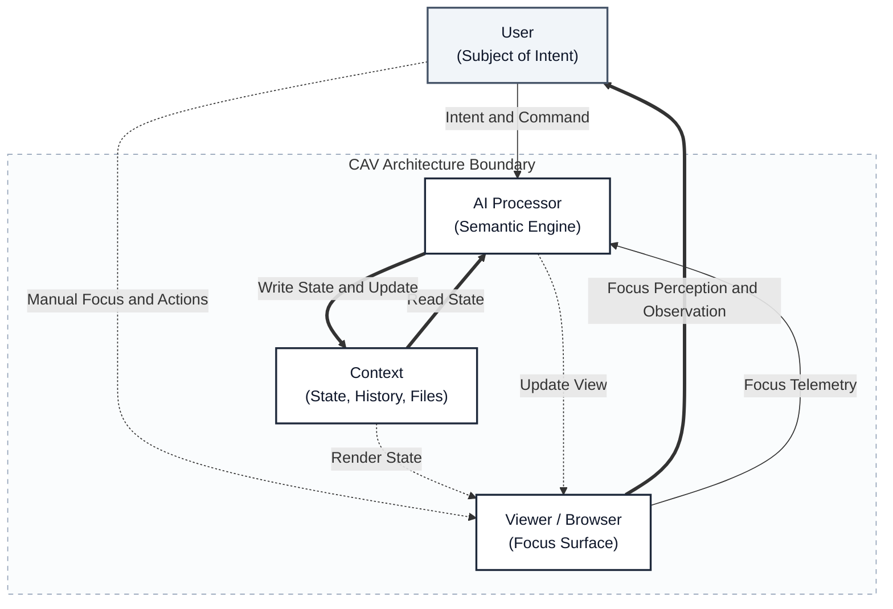

# После GUI: CAV-модель как архитектура AI-интерфейсов следующего поколения

**Введение: Почему интерфейсы умирают, и куда движется индустрия**

Мы находимся в конце эпохи классического графического интерфейса (GUI). Пользователь скоро перестанет быть оператором машинной логики — искать нужные кнопки в перегруженных меню 1С, Jira, Notion или Word. Но замена интерфейсов на диалоговые «чат-боты» похоже, провалилась. Чат линеен, он теряет контекст, а результат работы (Output) не возвращается в среду (Input). Пользователь стал просто «копипастером» между ИИ-оракулом и своими документами.

Индустрия прямо сейчас лихорадочно пытается нащупать выход из этого тупика. Обратите внимание на события первой половины 2026 года:

1. **Cursor** показал феноменальный рост, доказав, что код нужно писать не через отдельный чат, а напрямую в файловой системе проекта, управляя фокусом ИИ (Cmd+K).
2. **Anthropic** со своими Artifacts (включая недавнее расширение Claude Code Artifacts) учит агентов генерировать интерактивные HTML-дашборды и веб-страницы на лету, выводя результат за пределы текстового окна.

На мой взгляд, все эти линии развития интуитивно движутся к одной и той же архитектуре. Это уже моя интерпретация тренда, а не их собственная заявленная теория. Я формализовал этот паттерн и назвал его **CAV-моделью (Context + AI + Viewer)**.

Мой ключевой тезис таков: **интерактивный Viewer / Browser должен рассматриваться как полноправный архитектурный слой AI-среды, а не как вторичный UI-выход**. Он не просто показывает результат, а создаёт представление для User, формирует разделяемый фокус между User и AI и возвращает внимание пользователя обратно в рабочий контекст как операционный сигнал.

Вместо того чтобы ждать, пока корпорации соберут из этого закрытые SaaS-продукты, я описываю CAV как открытый архитектурный подход. Чтобы показать его жизнеспособность за пределами редакторов кода (IDE), я уже собрал рабочий MVP — **Context Browser**. Это накопительная рабочая среда для аналитиков и технических писателей:

- **Context** лежит на жестком диске в виде обычных Markdown-файлов под защитой Git (что дает мгновенный откат любых ошибок ИИ).
- **AI (Агент)** работает в фоне как семантический процессор: он принимает ваше намерение (через встроенный чат) и преобразует его в прямые изменения файлов.
- **Viewer** — это обычная вкладка браузера, которая рендерит файлы, на лету подсвечивает изменения и работает как слой разделяемого фокуса между пользователем и агентом.
  
  



Рис. 1. Схема когнитивно-операционного цикла взаимодействия пользователя (User), контекста (Context), ИИ-процессора (AI) и слоя фокусировки (Viewer).


**Главное отличие этого подхода от Claude Artifacts — полноценная двусторонняя связь.** В Artifacts сгенерированный результат зависает в чате как изолированная песочница: чтобы сохранить работу, его по-прежнему нужно копировать руками. В CAV-модели цикл замкнут (Output → Input): ИИ-агент пишет изменения напрямую в файловую систему, а Viewer мгновенно отражает обновлённую реальность. Контекст накапливается на диске, а не теряется при закрытии вкладки.

Ключевая особенность этой связки — механика **вложенного фокуса (Nested Focus)**. Технически она реализована через знакомый паттерн: подобно тому, как скрипты веб-аналитики собирают данные о кликах на сайте, наш Viewer собирает «телеметрию внимания». Вы выделяете текст в браузере, а лёгкий JavaScript на странице захватывает это состояние и передаёт его локальному AI-агенту.

В результате ИИ получает не оторванный от реальности промпт, а точные смысловые координаты рабочей сцены: в каком файле, разделе, блоке и на какой строке вы сейчас находитесь. Это позволяет агенту, получившему ваше намерение из чата, действовать с хирургической точностью и преобразовывать только нужный фрагмент локального документа.

### В чем реальная новизна: от теории к архитектуре

Идеи о том, что рабочая среда должна быть продолжением когнитивного процесса, не новы. В академическом HCI (Human-Computer Interaction) это давно описывается через теории **Distributed Cognition** (познание, распределенное между человеком и инструментами, Hutchins) и **Context-Aware Computing** (Dey), а структурно CAV прямо наследует классическую архитектуру **MVC (Model-View-Controller)**, переводя ее детерминированные связи на семантический уровень. В современной индустрии к этим же паттернам интуитивно нащупывают путь такие продукты, как Cursor или GitHub Copilot Workspace.

Почему же мы говорим о CAV-модели как о новой архитектуре именно сейчас, а не 20 лет назад?

Потому что десятилетиями нам не хватало главного звена. Раньше система могла хранить контекст и показывать его, но преобразовывать его человек должен был вручную — алгоритмами, кликами и скриптами. Появление агентов и LLM позволило замкнуть этот цикл. CAV-модель — это не отмена старого HCI, а его долгожданная инженерная реализация в эпоху генеративного ИИ.

Чтобы не путать CAV с обычными «умными чат-ботами» или устаревшими концептами, я выделяю три строгих отличия, на которых строится эта архитектура:

1. **Viewer как активный сенсор внимания (Экран + Сенсор).** В классическом софте, а также в инструментах вроде Anthropic Artifacts, Viewer — это просто поверхность вывода. В CAV-модели Viewer — это двусторонний слой. Он не только показывает измененную реальность, но и работает как «телеметрия внимания». Он непрерывно собирает фокус пользователя и возвращает его в систему как операционные координаты для следующего шага.
2. **AI как семантический, а не алгоритмический процессор.** Классический контекстно-зависимый софт работал по жестким правилам (если условие А, то действие Б). В CAV-среде AI работает со смыслами: он способен принять нестрогое, «человеческое» намерение (Intent) и перевести его в точную хирургическую операцию над сложным контекстом.
3. **Жесткий закон сохранения: Output → Input.** В чатах сохранение результата — это опция или ручной труд («скопируй и вставь к себе в документ»). В CAV это непреложный физический закон системы. Если сгенерированный результат не вернулся в Context как новый слой (файл, версия, схема, комментарий) — цикл разорван. Система обязана быть накопительной (Accumulative), а не транзакционной.

Именно эти три сдвига отличают CAV-среду от прикрученного сбоку копайлота. Ниже — полный архитектурный манифест CAV-модели. Он описывает законы проектирования сред, где AI преобразует контекст, Viewer выступает слоем фокусировки и обратной передачи внимания, а человек — субъектом воли и намерения.

# 1. Назначение CAV-модели

CAV-модель задаёт способ организации AI-среды вокруг трёх базовых компонентов:

```text
Context + AI + Viewer
```

Где:

- **Context** содержит рабочую реальность: данные, историю, артефакты, доменные знания, ограничения и текущую задачу.
- **AI** выступает семантическим процессором: интерпретирует намерение пользователя и преобразует контекст.
- **Viewer** создаёт представление обновлённого контекста для пользователя, формирует фокус внимания и делает этот фокус разделяемым между User и AI.

Пользователь в этой модели не является оператором интерфейса. Он не обязан вручную переводить своё намерение в поля формы, фильтры, кнопки и команды. Его роль выше: задавать направление, формулировать намерение, управлять фокусом и принимать решения.

Ключевой архитектурный сдвиг CAV состоит в том, что Viewer здесь не сводится к окну вывода. Это отдельный слой, через который фокус не только показывается пользователю, но и возвращается обратно в систему.

CAV-модель нужна для описания AI-интерфейсов, где главный процесс выглядит не как «пользователь нажал кнопку — система выдала результат», а как накопительный цикл:

```text
User задаёт намерение
AI преобразует Context
Viewer создаёт Focus
User воспринимает результат
Output возвращается в Context
```

Результат работы не исчезает в виде разового ответа. Он становится новым слоем контекста и используется в следующем цикле.

Главная задача CAV-модели — дать простой архитектурный язык для проектирования AI-сред под конкретные классы задач: чат, техническая документация, аналитика, разработка ПО, управление проектами, AR-сценарии и инженерная поддержка.

Коротко:

> **CAV-модель описывает AI-среду, в которой Context накапливает рабочую реальность, AI преобразует её согласно намерению пользователя, а Viewer создаёт и удерживает разделяемый фокус для восприятия и следующего шага.**

# 2. Базовая онтика: User, Context, AI, Viewer

CAV-модель опирается на четыре сущности:

```text
User + Context + AI + Viewer
```

Архитектурное ядро модели — это триада:

```text
Context + AI + Viewer
```

**User** находится над этой триадой как управляющий субъект: задаёт намерение, выбирает направление работы, оценивает результат и принимает решения.

## User

**User** — это не оператор интерфейса, а субъект намерения.

Он не обязан вручную собирать запрос через формы, фильтры и меню. Задача User — обозначать желаемое состояние, управлять фокусом и принимать решения по смыслу.

User выполняет роли:

- режиссёра;
- архитектора;
- креатора;
- постановщика задачи;
- оценщика результата.

Коротко:

```text
User направляет.
```

## Context

**Context** — это рабочая реальность системы.

Он включает не только данные, но и всё, что делает их осмысленными: историю, артефакты, домен, правила, ограничения, текущую задачу и уже принятые решения.

Context может содержать:

- файлы;
- документы;
- историю диалога;
- базы данных;
- исходные материалы;
- доменные знания;
- требования;
- схемы;
- замечания;
- созданные артефакты;
- состояние текущей работы.

Context не является пассивным хранилищем. Он накапливается и меняется в ходе работы.

Коротко:

```text
Context содержит и накапливает.
```

## AI

**AI** — это семантический процессор, который принимает намерение User, читает Context, выделяет релевантное, преобразует рабочую реальность и формирует новое состояние для предъявления через Viewer.

AI может включать:

- LLM;
- память;
- инструменты;
- агентов;
- поиск;
- скрипты;
- API;
- политики доступа;
- механизмы проверки.

AI в CAV-модели не просто отвечает. Он преобразует Context.

Коротко:

```text
AI преобразует.
```

## Viewer

**Viewer** — это средство проявления, фокусировки и разделения Context между User и AI.

Он показывает User не весь Context, а его воспринимаемый фрагмент: рабочую сцену, актуальное состояние, важные изменения, проблемные места, созданные артефакты. Viewer не только визуализирует состояние, но и задаёт операционный фокус, с которым затем работает AI.

Viewer может быть разным:

- чат;
- документ;
- таблица;
- схема;
- карта;
- IDE;
- dashboard;
- AR-наложение;
- окно браузера;
- рабочий стол.

Viewer не просто отображает результат. Он создаёт фокус внимания, через который User воспринимает обновлённый Context и формирует следующее намерение, а в интерактивной реализации возвращает этот фокус обратно в систему.

Коротко:

```text
Viewer фокусирует.
```

## Базовая формула

```text
User направляет.
Context содержит.
AI преобразует.
Viewer фокусирует.
```

Или в виде цикла:

```text
User → AI → Viewer → User
        ↑
     Context
```

Полная смысловая расшифровка:

```text
User задаёт намерение.
AI читает и преобразует Context.
Viewer показывает сфокусированное состояние Context.
User воспринимает результат и уточняет намерение.
Output возвращается в Context.
```

Главное отличие CAV-модели от классического интерфейса состоит в том, что User больше не обязан быть оператором машинной структуры. Он работает с намерением, а преобразование намерения в структуру, действие и представление берёт на себя AI.

# 3. Главная петля: Intent → Transform → Focus → Re-intent

CAV-модель описывает не статичную структуру, а рабочий цикл.

Базовая петля:

```text
Intent → Transform → Focus → Re-intent
```

Или в терминах сущностей:

```text
User → AI → Viewer → User
        ↑
     Context
```

## Intent

**Intent** — это намерение User.

Намерение не равно команде. Команда обычно точна и формальна: “открой файл”, “нажми кнопку”, “выбери дату”. Намерение может быть неполным, нестрогим и смысловым:

```text
“Сделай раздел понятнее”
“Найди причину просадки”
“Собери структуру документа”
“Покажи, где здесь риск”
“Сравни варианты”
```

В CAV-модели User управляет не кнопками, а направлением преобразования Context.

## Transform

**Transform** — это работа AI с Context.

AI интерпретирует намерение, выбирает релевантную часть Context, выполняет преобразование и создаёт новое состояние рабочей реальности.

Преобразование может быть разным:

- анализ;
- генерация текста;
- структурирование;
- поиск;
- расчёт;
- проверка;
- сравнение;
- классификация;
- построение схемы;
- обновление артефакта.

Важно: AI не просто выдаёт ответ. Он изменяет Context или создаёт новый слой Context.

## Focus

**Focus** — это сфокусированное представление Context, которое создаёт Viewer.

Viewer не показывает всё. Он выбирает и оформляет то, что сейчас должно быть воспринято User:

- текущий результат;
- проблемное место;
- новую структуру;
- отличие версий;
- таблицу факторов;
- схему связей;
- карту рисков;
- список вопросов.

Focus нужен потому, что полный Context всегда шире человеческого внимания. Без Viewer-а User снова оказался бы перед кучей данных, только теперь семантически сгенерированной.

## Re-intent

После восприятия Focus User формирует новое намерение.

Он может:

- принять результат;
- уточнить направление;
- сузить фокус;
- изменить критерии;
- отклонить вариант;
- запросить проверку;
- перейти к следующему шагу.

Так возникает следующий цикл:

```text
новое намерение → новое преобразование → новый фокус
```

## Output → Input

Ключевой механизм CAV-модели:

```text
Output → Input
```

Результат работы не исчезает и не остаётся только в истории ответа. Он возвращается в Context.

Примеры:

```text
созданная структура документа → часть Context
схема процесса → часть Context
таблица анализа → часть Context
исправленный раздел → часть Context
замечание пользователя → часть Context
решение по термину → часть Context
```

Поэтому CAV-среда является накопительной. Она не просто отвечает на запросы, а постепенно наращивает рабочую реальность задачи.

## Короткая формула

```text
User задаёт Intent.
AI выполняет Transform.
Viewer создаёт Focus.
User формирует Re-intent.
Output возвращается в Context.
```

Или совсем кратко:

```text
Intent → Transform → Focus → Re-intent
```

Это главная операционная петля CAV-модели.


# 4. Слои контекста

В CAV-модели Context — не просто папка с файлами или набор данных. Это рабочая реальность, внутри которой User и AI выполняют задачу.

Контекст имеет вложенную структуру:

```text
Глобальный контекст мира
└── Широкий контекст / домен
    └── Локальный контекст задачи
```

## Глобальный контекст мира

**Глобальный контекст** — это самая широкая когнитивная оболочка.

Он включает:

- язык;
- культуру;
- здравый смысл;
- физическую реальность;
- социальные нормы;
- общие представления о мире;
- базовые причинно-следственные связи.

Этот слой обычно не фиксируется явно, но постоянно влияет на интерпретацию. Без него AI не сможет понять, что документ пишется для людей, схема должна быть читаемой, а инструкция должна вести к выполнимому действию.

Коротко:

```text
Глобальный контекст задаёт общую картину мира.
```

## Широкий контекст / домен

**Широкий контекст** — это предметная область, в которой решается задача.

Он включает:

- отрасль;
- компанию;
- проект;
- продукт;
- стандарты;
- регламенты;
- профессиональный язык;
- типовые практики;
- ограничения домена.

Например, для технической документации широким контекстом могут быть ГОСТ, внутренняя методология компании, архитектура продукта, роли пользователей и требования заказчика.

Коротко:

```text
Широкий контекст задаёт правила предметной области.
```

## Локальный контекст задачи

**Локальный контекст** — это то, с чем система работает прямо сейчас.

Он включает:

- текущий документ;
- выбранный раздел;
- открытые файлы;
- активные требования;
- текущую версию артефакта;
- историю последних решений;
- замечания;
- созданные в процессе работы материалы.

Локальный контекст — это рабочая сцена. Из него AI берёт материал для ближайшего преобразования, а Viewer создаёт фокус для User.

Коротко:

```text
Локальный контекст задаёт текущую рабочую сцену.
```

## Фокус

Фокус не равен контексту.

Контекст может быть широким, сложным и многослойным. Фокус — это часть контекста, которая сейчас выделена для восприятия и действия.

Примеры фокуса:

- конкретный абзац;
- один раздел документа;
- противоречие между двумя требованиями;
- строка таблицы;
- участок схемы;
- список нерешённых вопросов;
- отклонение на графике.

Viewer создаёт фокус, превращая часть Context в воспринимаемую рабочую сцену.

## Накопление локального контекста

Локальный контекст меняется в ходе работы.

```text
Input → Processing → Output → New Input
```

Созданные артефакты возвращаются в Context:

- новая схема становится частью задачи;
- исправленный раздел становится новой версией документа;
- комментарий User становится ограничением;
- найденное противоречие становится задачей на проверку;
- таблица трассировки становится рабочим инструментом.

Так CAV-среда становится накопительной системой.

## Короткая формула

```text
Глобальный контекст даёт картину мира.
Широкий контекст задаёт домен.
Локальный контекст задаёт рабочую сцену.
Viewer создаёт фокус.
AI преобразует Context.
Output возвращается в Context.
```


# 5. Роль AI как семантического процессора

В CAV-модели AI не сводится к языковой модели. Она может быть ядром, но сама роль AI шире.

**AI** — это семантический процессор, который преобразует Context согласно намерению User и подготавливает результат для Viewer.

```text
User Intent + Context → AI Transform → Updated Context → Viewer Focus
```

## AI не просто отвечает

В обычном чате AI часто воспринимается как система, выдающая текстовый ответ.

В CAV-модели этого недостаточно. AI должен не только отвечать, но и менять состояние рабочей среды:

- структурировать данные;
- создавать артефакты;
- обновлять документ;
- строить таблицы;
- формировать схемы;
- проверять противоречия;
- выделять пробелы;
- готовить варианты решений;
- вызывать инструменты;
- возвращать результат в Context.

Коротко:

```text
AI не отвечает.
AI преобразует.
```

## Состав AI-процессора

AI в CAV-модели может включать несколько слоёв:

```text
AI =
  LLM
  + память
  + инструменты
  + агенты
  + планировщик
  + политики доступа
  + механизмы проверки
```

У каждого слоя своя функция.

|Слой|Назначение|
|---|---|
|**LLM**|понимает язык, намерения и смысловые связи|
|**Память**|удерживает историю, предпочтения, решения|
|**Инструменты**|выполняют формальные операции: поиск, расчёты, API, файлы|
|**Агенты**|выполняют цепочки действий и подзадачи|
|**Планировщик**|разбивает намерение на шаги|
|**Политики доступа**|ограничивают действия AI|
|**Проверки**|контролируют качество, полноту и риски|

## Основные функции AI

AI-процессор выполняет несколько ключевых функций.

### 1. Интерпретация намерения

AI принимает неформальное намерение User и переводит его в рабочую задачу.

Пример:

```text
“Сделай этот раздел понятнее”
```

AI должен понять:

- какой раздел имеется в виду;
- для кого он должен стать понятнее;
- что считать избыточным;
- какие термины нельзя менять;
- какие требования должны сохраниться.

### 2. Выбор релевантного контекста

Полный Context всегда больше текущей задачи. AI должен выбрать то, что важно сейчас.

Он отделяет:

```text
релевантное → используется
нерелевантное → игнорируется
сомнительное → выносится в вопросы
```

### 3. Преобразование контекста

AI изменяет рабочий материал:

- переписывает текст;
- строит структуру;
- извлекает требования;
- группирует данные;
- сравнивает версии;
- создаёт диаграмму;
- формирует вывод.

### 4. Подготовка представления для Viewer

AI должен не просто создать результат, а подготовить его так, чтобы Viewer мог сформировать фокус.

Например, вместо длинного текстового вывода AI может подготовить:

- таблицу;
- список различий;
- дерево структуры;
- карту рисков;
- диаграмму связей;
- карточки вариантов;
- dashboard готовности.

### 5. Возврат результата в Context

Созданный результат становится новым элементом Context.

```text
новый раздел → Context
таблица требований → Context
решение User → Context
список вопросов → Context
схема архитектуры → Context
```

Это делает работу накопительной.

## AI как исполнитель, а не субъект цели

В CAV-модели AI не является автором цели. Цель задаёт User.

AI может предлагать варианты, находить противоречия, указывать на риски и рекомендовать действия, но он не должен самовольно менять направление работы.

Распределение ролей:

|Сущность|Роль|
|---|---|
|**User**|задаёт цель и принимает решение|
|**AI**|исполняет, интерпретирует, преобразует|
|**Viewer**|создаёт фокус восприятия|
|**Context**|хранит рабочую реальность|

## Короткая формула

```text
User задаёт зачем.
AI определяет как.
Context даёт материал.
Viewer показывает что получилось.
```

AI в CAV-модели — не собеседник сам по себе, а исполнительный смысловой слой, превращающий намерение User в обновлённое состояние Context.

# 6. Роль Viewer как механизма фокусировки

В CAV-модели Viewer — это не пассивное окно вывода, а **двунаправленный когнитивный сенсор**. Его задача — не просто показать результат, а создать разделяемый фокус внимания между человеком и машиной.

Viewer непрерывно собирает **телеметрию внимания** пользователя (паттерн Nested Focus): фиксирует, на каком файле, абзаце или строке сейчас находится фокус человека, какие фрагменты выделены или изменены. Эти координаты мгновенно возвращаются обратно к AI-процессору, превращая нечеткое намерение пользователя из чата в хирургически точную операцию над конкретным фрагментом контекста.

```text
Context ──> Viewer (Focus) ──> User
   ▲                             │
   └────── AI <── Telemetry ─────┘
```

Viewer превращает сложный, многослойный и потенциально перегруженный Context в рабочую сцену, с которой User может осмысленно работать.

## Viewer не равен экрану

Viewer может быть реализован по-разному:

- чат;
- документ;
- таблица;
- схема;
- карта;
- dashboard;
- IDE;
- AR-наложение;
- окно браузера;
- рабочий стол;
- специализированная панель управления.

Главное не форма, а функция:

```text
Viewer проявляет Context и создаёт Focus.
```

## Viewer создаёт фокус

Полный Context почти всегда слишком велик для прямого восприятия. В нём могут быть документы, история решений, требования, таблицы, версии, файлы, замечания, данные и внешние источники.

Viewer должен выбрать и представить то, что сейчас важно:

- текущий результат;
- проблемную зону;
- отличие между версиями;
- структуру документа;
- карту требований;
- список рисков;
- состояние процесса;
- выбранный объект;
- следующий шаг.

Viewer отвечает на вопрос:

```text
На что User должен смотреть прямо сейчас?
```

## Viewer как рабочая сцена

Viewer не просто показывает отдельный output. Он показывает состояние работы.

Например, в технической документации Viewer может одновременно показывать:

- текущий раздел;
- структуру документа;
- связанные требования;
- замечания эксперта;
- статус готовности;
- спорные термины;
- изменения версии.

Это превращает Viewer в рабочую сцену, где User видит не только текст, но и его положение внутри задачи.

## Viewer снижает когнитивную нагрузку

Без Viewer-а User вынужден удерживать структуру задачи в голове.

Плохой вариант:

```text
AI выдал длинный ответ.
User сам вспоминает, что важно, что уже сделано, что поменялось и где проблема.
```

Хороший вариант:

```text
Viewer показывает актуальное состояние, подсвечивает важное и скрывает лишнее.
```

Viewer снижает нагрузку за счёт:

- отбора релевантного;
- визуальной структуры;
- группировки;
- подсветки изменений;
- удержания состояния;
- отделения черновика от результата;
- показа связей между объектами.

## Viewer может быть линейным и нелинейным

Чат — это линейный Viewer. Он показывает Context как последовательность сообщений.

Это удобно для:

- рассуждения;
- уточнения намерений;
- обсуждения вариантов;
- черновиков;
- концептуализации.

Но чат слаб для:

- таблиц;
- карт;
- схем;
- больших документов;
- сложных процессов;
- сравнения версий;
- работы с объектами.

Поэтому развитая CAV-среда должна поддерживать разные Viewer-ы под разные типы Context.

## Типы Viewer-ов

|Тип Viewer|Что фокусирует|
|---|---|
|**Chat Viewer**|ход рассуждения и диалог|
|**Document Viewer**|текст и структуру документа|
|**Table Viewer**|данные, строки, показатели, сравнения|
|**Diagram Viewer**|связи, процессы, архитектуру|
|**Dashboard Viewer**|состояние, метрики, статусы, риски|
|**IDE Viewer**|код, файлы, ошибки, тесты|
|**Map Viewer**|пространство и маршруты|
|**AR Viewer**|физический объект и наложенные подсказки|

## Viewer и управление вниманием

User управляет намерением, но Viewer управляет видимой сценой.

Это важное различие:

```text
User говорит, что важно.
AI решает, как преобразовать Context.
Viewer показывает, где теперь находится фокус.
```

Если Viewer плохой, даже сильный AI становится менее полезным. Он может правильно преобразовать Context, но User не увидит нужный фокус. Получится умная система с мутным стеклом.

## Короткая формула

```text
Context содержит слишком много.
AI преобразует нужное.
Viewer показывает важное.
User принимает решение.
```

Или ещё короче:

```text
Viewer — это не экран.
Viewer — это фокусирующая поверхность Context.
```

В CAV-модели качество Viewer-а определяет, насколько результат работы AI становится понятным, проверяемым и управляемым для User.

# 7. Output → Input: накопление контекста

Один из ключевых принципов CAV-модели:

```text
Output → Input
```

Результат работы AI не должен оставаться разовым ответом, исчезающим в истории диалога. Он должен возвращаться в Context и становиться материалом следующего цикла.

## Output не является финалом

В классическом интерфейсе результат часто воспринимается как завершение операции:

```text
запрос → обработка → результат
```

В CAV-модели результат — это не конец, а новый слой рабочей реальности:

```text
намерение → преобразование → output → обновлённый context → новое намерение
```

Каждый результат увеличивает и уточняет Context.

## Что может стать новым Input

В Context возвращаются не только финальные документы или файлы. Важны также промежуточные артефакты.

Примеры:

- черновик раздела;
- таблица требований;
- список вопросов;
- схема процесса;
- карта рисков;
- найденное противоречие;
- решение по терминологии;
- комментарий User;
- новая версия документа;
- результат проверки;
- diff между версиями;
- вывод аналитики.

Даже ошибка может стать полезным Input, если она зафиксирована как ограничение:

```text
“Так больше не формулировать”
“Этот термин не использовать”
“Этот источник считать устаревшим”
“Этот вариант отклонён”
```

## Накопительная рабочая среда

CAV-среда отличается от обычного чата тем, что накапливает состояние задачи.

Плохой вариант:

```text
AI дал ответ.
User скопировал его куда-то.
Контекст потерян.
Следующий запрос начинается почти с нуля.
```

Хороший вариант:

```text
AI создал артефакт.
Артефакт попал в Context.
Viewer показывает обновлённое состояние.
Следующий шаг опирается на уже созданное.
```

Так возникает накопительный цикл:

```text
Context₁ → AI → Output₁ → Context₂ → AI → Output₂ → Context₃
```

## Почему это важно

Принцип `Output → Input` делает AI-систему не генератором ответов, а рабочей средой.

Он позволяет:

- сохранять решения;
- не терять промежуточные выводы;
- строить сложные артефакты по частям;
- проверять историю изменений;
- накапливать терминологию;
- уточнять требования;
- возвращаться к предыдущим версиям;
- использовать результаты проверки как новые ограничения.

Без этого AI работает как умный собеседник. С этим — как часть производственного контура.

## Пример: техническая документация

User задаёт намерение:

```text
“Собери структуру руководства администратора”
```

AI создаёт структуру.

Эта структура становится частью Context.

Потом User говорит:

```text
“Теперь раскрой раздел про резервное копирование”
```

AI уже работает не с пустым запросом, а с обновлённым Context:

- есть структура документа;
- есть место раздела;
- есть стиль;
- есть требования;
- есть уже принятые решения.

Так документ растёт не как набор отдельных ответов, а как единый артефакт.

## Пример: аналитика

User спрашивает:

```text
“Почему упала маржинальность?”
```

AI строит таблицу факторов.

Таблица становится частью Context.

Следующий запрос:

```text
“Проверь отдельно влияние скидок по регионам”
```

AI уже использует предыдущую таблицу факторов как рабочую основу.

Output первого шага стал Input второго.

## Риск: загрязнение контекста

У принципа `Output → Input` есть опасность.

Если ошибочный результат автоматически возвращается в Context, система начинает строить следующие выводы на плохом основании.

Поэтому нужен контроль качества:

- пометка статуса артефакта;
- различение черновика и утверждённой версии;
- журнал изменений;
- ссылки на источники;
- возможность отката;
- явное принятие User;
- проверка противоречий.

Context должен накапливаться не как свалка, а как управляемая рабочая память.

## Статусы артефактов

Для зрелой CAV-среды полезны статусы:

|Статус|Смысл|
|---|---|
|**Draft**|черновик, можно использовать осторожно|
|**Reviewed**|проверено пользователем или экспертом|
|**Approved**|принято как рабочая версия|
|**Rejected**|отклонено, но сохранено как история решения|
|**Deprecated**|устарело, не использовать как основание|
|**Questionable**|требует проверки|

Так Context остаётся живым, но не превращается в болото.

## Короткая формула

```text
Output не выходит из системы.
Output возвращается в Context.
Context становится богаче.
Следующее намерение работает с обновлённой реальностью.
```

Или ещё короче:

```text
AI создаёт.
Context накапливает.
Viewer показывает.
User утверждает.
```

Принцип `Output → Input` превращает CAV-модель в основу проектирования накопительных рабочих сред: документационных, аналитических, инженерных, программных и управленческих.

# 8. Варианты реализации CAV-модели

CAV-модель — общая архитектурная рамка. Она не привязана к одному интерфейсу или одному типу задач.

Одна и та же логика может быть реализована через разные сочетания Context, AI и Viewer:

```text
Context + AI + Viewer
```

Различия между реализациями определяются тем:

- какой Context используется;
- какой AI-процессор его преобразует;
- какой Viewer создаёт фокус для User;
- какой тип Output возвращается обратно в Context.

## 8.1. Chat CAV

Самая простая реализация CAV — чат.

```text
Context = история беседы + файлы + память + внешние источники
AI = LLM / агент
Viewer = лента сообщений
```

Чатовый Viewer показывает Context линейно: сообщение за сообщением.

Он хорошо подходит для:

- обсуждения;
- концептуализации;
- постановки задач;
- черновиков;
- объяснений;
- смыслового поиска;
- уточнения намерений.

Слабые стороны Chat CAV:

- длинная лента быстро перегружается;
- результат уходит вверх по истории;
- трудно работать с большими структурами;
- плохо видны связи, версии, таблицы, схемы;
- процесс и результат смешиваются в одном потоке.

Кратко:

```text
Чат — это линейный Viewer.
Он хорош для смысла, но слаб для сложной структуры.
```

## 8.2. Documentation CAV

Реализация CAV для технической документации.

```text
Context = исходники + требования + стандарты + структура документа + версии + замечания
AI = LLM + агент + проверки + инструменты работы с файлами
Viewer = документ + структура + diff + dashboard готовности
```

User задаёт намерения:

```text
“Собери структуру документа”
“Проверь покрытие требований”
“Перепиши раздел проще”
“Найди противоречия”
“Подготовь вопросы к эксперту”
```

AI преобразует документный Context:

- извлекает требования;
- строит структуру;
- пишет разделы;
- проверяет полноту;
- связывает текст с источниками;
- формирует таблицу трассировки;
- обновляет документ.

Viewer показывает:

- текущий документ;
- дерево разделов;
- статус готовности;
- замечания;
- непокрытые требования;
- различия версий;
- проблемные места.

Кратко:

```text
Documentation CAV превращает написание документа
в накопительный инженерный процесс.
```

## 8.3. Analytical CAV

Реализация CAV для бизнес-аналитики и управленческих решений.

```text
Context = данные + метрики + отчёты + гипотезы + история решений
AI = аналитический процессор + LLM + Python/SQL + проверки
Viewer = таблицы + графики + dashboard + текстовые выводы
```

User задаёт намерение:

```text
“Покажи, почему просела маржинальность”
“Найди аномалии в продажах”
“Сравни регионы”
“Построй прогноз”
“Выдели факторы роста”
```

AI:

- выбирает релевантные данные;
- строит расчёты;
- проверяет гипотезы;
- ищет выбросы;
- группирует факторы;
- формирует выводы.

Viewer показывает:

- графики;
- таблицы факторов;
- ключевые отклонения;
- гипотезы;
- риски;
- рекомендации;
- вопросы к данным.

Output возвращается в Context:

- расчёты;
- графики;
- выводы;
- гипотезы;
- версии отчётов;
- управленческие решения.

Кратко:

```text
Analytical CAV заменяет работу с BI-фильтрами
на работу с аналитическим намерением.
```

## 8.4. IDE / Software CAV

Реализация CAV для разработки программного обеспечения.

```text
Context = репозиторий + issue + код + тесты + архитектура + документация
AI = coding agent + LLM + терминал + инструменты анализа
Viewer = IDE + diff + test output + logs + task board
```

User задаёт намерение:

```text
“Добавь валидацию”
“Найди причину ошибки”
“Разбей модуль”
“Напиши тесты”
“Объясни архитектуру”
```

AI:

- читает код;
- анализирует зависимости;
- предлагает изменения;
- редактирует файлы;
- запускает тесты;
- проверяет ошибки;
- формирует diff.

Viewer показывает:

- изменённые файлы;
- diff;
- ошибки тестов;
- структуру проекта;
- логи;
- предупреждения;
- статус задачи.

Кратко:

```text
Software CAV превращает IDE в Viewer для контекста разработки,
а AI — в семантического исполнителя изменений.
```

## 8.5. AR / Physical-world CAV

Реализация CAV для работы с физическим миром.

```text
Context = объект + сенсоры + камера + инструкции + история обслуживания
AI = мультимодальный процессор + агент + база знаний
Viewer = AR-очки / камера телефона / наложенные подсказки
```

User задаёт намерение:

```text
“Покажи, что здесь сломано”
“Как это разобрать?”
“Куда подключить этот кабель?”
“Проверь, правильно ли собрано”
```

AI:

- анализирует изображение;
- распознаёт объект;
- сопоставляет его с инструкцией;
- выбирает следующий шаг;
- проверяет состояние;
- формирует подсказку.

Viewer показывает:

- стрелки;
- выделенные зоны;
- предупреждения;
- пошаговые инструкции;
- наложенные схемы;
- статус операции.

Кратко:

```text
AR CAV делает физический мир Viewer-ом,
а AI — переводчиком между объектом, инструкцией и действием.
```

## 8.6. Общая таблица реализаций

|Реализация|Context|AI|Viewer|
|---|---|---|---|
|**Chat CAV**|история, файлы, память|LLM|чат-лента|
|**Documentation CAV**|исходники, требования, версии|LLM + агент + проверки|документ, структура, diff|
|**Analytical CAV**|данные, метрики, отчёты|LLM + Python/SQL|таблицы, графики, dashboard|
|**Software CAV**|код, issue, тесты|coding agent|IDE, diff, logs|
|**AR CAV**|объект, сенсоры, инструкции|multimodal AI|AR-наложение|

## Короткая формула

```text
Разные задачи требуют разных CAV-конфигураций.
Context задаёт материал.
AI задаёт способ преобразования.
Viewer задаёт способ фокусировки.
```

CAV-модель полезна потому, что позволяет проектировать AI-среду под конкретный класс задач, а не просто добавлять чат к существующему интерфейсу.

# 9. Критерии качества CAV-системы

CAV-модель можно использовать не только для описания, но и для оценки AI-среды.

Хорошая CAV-система должна отвечать на четыре базовых вопроса:

```text
Есть ли нужный Context?
Достаточно ли силён AI?
Правильно ли Viewer создаёт Focus?
Сохраняется ли результат обратно в Context?
```

## 9.1. Контекстность

Первый критерий — качество Context.

Система должна иметь доступ к данным, истории, артефактам и ограничениям, реально нужным для задачи.

Плохой вариант:

```text
AI отвечает только по последнему сообщению.
```

Хороший вариант:

```text
AI видит текущую задачу, исходные данные, историю решений,
артефакты, ограничения и доменные правила.
```

Проверочные вопросы:

- видит ли AI нужные источники;
- различает ли актуальные и устаревшие данные;
- понимает ли текущую задачу;
- учитывает ли принятые решения;
- видит ли созданные ранее артефакты;
- не тащит ли в задачу лишний контекст.

Коротко:

```text
Контекст должен быть достаточным, но не шумным.
```

## 9.2. Фокусировка

Второй критерий — качество Viewer-а.

Viewer должен показывать не всё подряд, а то, что важно для следующего решения User.

Плохой вариант:

```text
Система выдаёт длинную простыню текста или огромную таблицу.
```

Хороший вариант:

```text
Viewer показывает состояние, проблемные места, изменения,
следующий шаг и то, что требует решения.
```

Проверочные вопросы:

- видно ли, что сейчас главное;
- отделён ли результат от процесса;
- понятен ли статус работы;
- подсвечены ли риски и пробелы;
- можно ли быстро перейти к нужному фрагменту;
- не перегружает ли Viewer внимание.

Коротко:

```text
Viewer должен создавать Focus, а не информационный туман.
```

## 9.3. Преобразующая способность AI

Третий критерий — способность AI не просто отвечать, а преобразовывать Context.

Плохой вариант:

```text
AI пишет комментарии, но не меняет рабочую среду.
```

Хороший вариант:

```text
AI создаёт артефакты, обновляет документы, строит схемы,
делает расчёты, проверяет требования и возвращает результат в Context.
```

Проверочные вопросы:

- умеет ли AI работать с файлами;
- может ли выполнять цепочки действий;
- может ли вызывать инструменты;
- может ли проверять результат;
- может ли создавать структурированные артефакты;
- может ли обновлять Context, а не только генерировать текст.

Коротко:

```text
AI должен быть процессором, а не говорящей справкой.
```

## 9.4. Накопительность

Четвёртый критерий — сохраняется ли результат работы в Context.

Плохой вариант:

```text
Ответ появился в чате и потерялся в истории.
```

Хороший вариант:

```text
Созданный артефакт стал частью рабочей среды:
файлом, версией, таблицей, схемой, замечанием или решением.
```

Проверочные вопросы:

- попадает ли Output обратно в Context;
- фиксируются ли версии;
- видны ли изменения;
- сохраняются ли решения;
- можно ли использовать результат в следующем цикле;
- можно ли откатиться к предыдущему состоянию.

Коротко:

```text
Если Output не стал Input, CAV-цикл оборвался.
```

## 9.5. Проверяемость

Пятый критерий — можно ли проверить результат.

AI-система должна показывать, откуда взялись выводы и на чём основаны изменения.

Проверяемость включает:

- ссылки на источники;
- трассировку требований;
- diff изменений;
- журнал действий;
- объяснение допущений;
- выделение неопределённостей;
- статус уверенности;
- список вопросов к User или эксперту.

Плохой вариант:

```text
AI уверенно выдал результат, но непонятно, почему именно такой.
```

Хороший вариант:

```text
AI показывает основания, источники, изменения и зоны сомнения.
```

Коротко:

```text
Без проверяемости CAV превращается в магический ящик.
```

## 9.6. Управляемость

Шестой критерий — способность User управлять системой через намерение и фокус.

User должен иметь возможность:

- сузить задачу;
- сменить фокус;
- отклонить вариант;
- утвердить результат;
- ограничить автономию AI;
- потребовать проверку;
- вернуть предыдущую версию;
- изменить критерии качества.

Плохой вариант:

```text
AI сделал “как понял”, а User вынужден разгребать последствия.
```

Хороший вариант:

```text
User ясно видит состояние, может направить AI
и контролирует границы изменений.
```

Коротко:

```text
User должен оставаться субъектом цели и решения.
```

## 9.7. Сменяемость Viewer-ов

Седьмой критерий — возможность использовать подходящий Viewer под тип задачи.

Один чат не должен быть единственным способом представления Context.

Примеры:

|Задача|Подходящий Viewer|
|---|---|
|Рассуждение|Chat Viewer|
|Документ|Document Viewer|
|Требования|Table / Traceability Viewer|
|Архитектура|Diagram Viewer|
|Код|IDE Viewer|
|Метрики|Dashboard Viewer|
|Физический объект|AR Viewer|

Коротко:

```text
Разный Context требует разного Viewer-а.
```

## 9.8. Итоговая таблица критериев

|Критерий|Главный вопрос|
|---|---|
|**Контекстность**|видит ли система нужную рабочую реальность?|
|**Фокусировка**|показывает ли Viewer главное?|
|**Преобразование**|умеет ли AI менять Context?|
|**Накопительность**|возвращается ли Output обратно в Context?|
|**Проверяемость**|можно ли понять основания результата?|
|**Управляемость**|остаётся ли User субъектом цели?|
|**Сменяемость Viewer-ов**|соответствует ли форма просмотра типу задачи?|

## Короткая формула

```text
Хорошая CAV-система:
видит нужный Context,
преобразует его через AI,
показывает Focus через Viewer,
возвращает Output обратно в Context
и оставляет User контроль над целью.
```

# 10. Ограничения и риски CAV-модели

CAV-модель усиливает AI-среду, но не отменяет риски. Чем больше Context, чем сильнее AI и богаче Viewer, тем выше требования к управлению, проверке и границам автономии.

Главная опасность CAV-системы в том, что ошибка может не просто появиться в ответе, а попасть обратно в Context и стать основанием для следующих действий.

```text
ошибочный Output → Context → новый Transform → усиленная ошибка
```

Поэтому CAV требует не только хорошего AI, но и дисциплины работы с контекстом.

## 10.1. Смешение контекстов

AI может привлечь нерелевантные данные из широкого Context и использовать их в локальной задаче.

Пример:

```text
User просит доработать текущий документ,
а AI подтягивает устаревший шаблон, старую версию требований
или нерелевантные обсуждения из другой задачи.
```

Риск:

- неверные выводы;
- загрязнение документа;
- потеря фокуса;
- ложная уверенность.

Меры защиты:

- явно задавать локальный Context;
- маркировать актуальные и устаревшие источники;
- отделять проектные папки;
- использовать статусы артефактов;
- показывать источники, на которые опирался AI.

Коротко:

```text
Context должен быть управляемым, а не бесконечным.
```

## 10.2. Ложный фокус

Viewer может красиво показать не то, что действительно важно.

Это особенно опасно, потому что хороший Viewer создаёт ощущение ясности. Если фокус выбран неверно, User может принять ошибочную картину задачи за правильную.

Пример:

```text
Dashboard показывает высокий процент готовности документа,
но не показывает, что ключевые требования не покрыты.
```

Риск:

- неверные управленческие решения;
- преждевременное утверждение результата;
- пропуск критических проблем.

Меры защиты:

- показывать основания фокуса;
- явно выделять непроверенные зоны;
- использовать несколько Viewer-ов;
- не сводить качество к одной метрике;
- давать User возможность менять фокус.

Коротко:

```text
Viewer должен не украшать Context, а честно проявлять его состояние.
```

## 10.3. Непрозрачное преобразование

AI может преобразовать Context так, что User не поймёт, что именно изменилось и почему.

Пример:

```text
AI переписал раздел документа,
но не показал, какие требования были использованы,
что было удалено и какие допущения добавлены.
```

Риск:

- потеря трассируемости;
- скрытые смысловые изменения;
- трудности при проверке;
- снижение доверия.

Меры защиты:

- diff изменений;
- ссылки на источники;
- журнал действий;
- пояснение допущений;
- режим “предложить, но не применять”;
- разделение черновика и утверждённой версии.

Коротко:

```text
AI должен показывать не только результат, но и след преобразования.
```

## 10.4. Загрязнение Context

Принцип `Output → Input` полезен, но опасен. Если любой результат автоматически становится частью Context, рабочая среда быстро загрязняется.

В Context могут попасть:

- ошибочные выводы;
- галлюцинации;
- устаревшие версии;
- отклонённые идеи;
- временные черновики;
- непроверенные гипотезы.

Риск:

```text
система начинает опираться на собственный мусор
```

Это уже не AI, а бюрократ с автосохранением. Опасная форма жизни.

Меры защиты:

- статусы артефактов;
- явное утверждение User;
- версионирование;
- удаление или архивирование мусора;
- пометки Draft / Reviewed / Approved / Rejected;
- периодическая чистка Context.

Коротко:

```text
Накопление Context требует санитарии.
```

## 10.5. Потеря субъектности User

CAV-модель предполагает, что User остаётся источником цели и решения. Но сильный AI и убедительный Viewer могут постепенно вытеснить его из управления.

Плохой сценарий:

```text
AI сам выбирает цель,
сам определяет критерии,
сам обновляет Context,
сам показывает красивый Focus,
а User только соглашается.
```

Риск:

- автоматическое следование системе;
- снижение критичности;
- потеря контроля над задачей;
- размытие ответственности.

Меры защиты:

- явное подтверждение важных изменений;
- видимые границы автономии;
- возможность отката;
- режимы “предложить” и “применить”;
- фиксация решений User;
- разделение рекомендации и действия.

Коротко:

```text
AI исполняет. User решает.
```

## 10.6. Избыточная автономия

Если AI подключён к инструментам, API, файлам и внешним системам, ошибка может стать не только текстовой, но и операционной.

Пример:

```text
AI изменил файл, отправил письмо, обновил задачу,
запустил скрипт или удалил данные без достаточного контроля.
```

Риск:

- повреждение рабочих артефактов;
- утечка данных;
- неверные действия в бизнес-системах;
- потеря доверия к среде.

Меры защиты:

- права доступа;
- песочницы;
- журнал действий;
- подтверждение опасных операций;
- ограничение зоны действия;
- dry-run режим;
- backup и version control.

Коротко:

```text
Чем сильнее AI как исполнитель, тем жёстче должны быть границы.
```

## 10.7. Неподходящий Viewer

Не всякий Context можно хорошо показать одним Viewer-ом.

Чат плохо подходит для больших таблиц. Таблица плохо подходит для смысловой дискуссии. Dashboard плохо подходит для редактирования текста. AR плохо подходит для длинных юридических формулировок.

Риск:

- перегрузка внимания;
- потеря структуры;
- неверная интерпретация;
- рост ручной работы.

Меры защиты:

- выбирать Viewer под тип Context;
- поддерживать несколько представлений;
- отделять процесс от результата;
- использовать специализированные Viewer-ы для документов, таблиц, схем, кода и физического мира.

Коротко:

```text
Viewer должен соответствовать природе задачи.
```

## 10.8. Иллюзия полноты Context

Даже большая CAV-среда не содержит весь мир. AI может выглядеть уверенно, хотя работает с неполным Context.

Пример:

```text
AI анализирует требования,
но не знает о свежем письме заказчика,
устной договорённости или новой версии регламента.
```

Риск:

- ошибочная уверенность;
- неверные выводы;
- пропуск важных ограничений.

Меры защиты:

- показывать границы Context;
- явно указывать использованные источники;
- выводить список недостающих данных;
- задавать вопросы при критических пробелах;
- маркировать выводы как предварительные.

Коротко:

```text
CAV должна показывать не только что знает, но и чего не знает.
```

## 10.9. Итоговая таблица рисков

|Риск|Суть|Защита|
|---|---|---|
|**Смешение контекстов**|AI использует нерелевантное|явный локальный Context|
|**Ложный фокус**|Viewer показывает не главное|основания фокуса, смена Viewer-а|
|**Непрозрачное преобразование**|непонятно, что изменилось|diff, источники, журнал|
|**Загрязнение Context**|плохой Output стал Input|статусы, review, версионирование|
|**Потеря субъектности User**|AI начинает вести цель|подтверждения, границы автономии|
|**Избыточная автономия**|AI действует слишком широко|права, sandbox, dry-run|
|**Неподходящий Viewer**|форма просмотра не соответствует задаче|специализированные Viewer-ы|
|**Иллюзия полноты**|Context кажется полнее, чем есть|показ границ знания|

## Короткая формула

```text
CAV усиливает AI-среду,
но требует управления Context,
прозрачности Transform,
качества Viewer
и сохранения субъектности User.
```

Главное правило:

> Чем сильнее CAV-система преобразует рабочую реальность, тем важнее проверяемость, статусы, журнал действий, откат и явные границы автономии.


# 11. Практика проектирования IWE через CAV

CAV-модель полезна не только для описания AI-интерфейсов, но и как практический метод проектирования IWE — Integrated Working Environment — под конкретный класс задач.

Главная идея:

```text
IWE = Context + AI + Viewer, собранные под задачу User
```

Рабочую среду нужно проектировать не как набор приложений, а как связку:

- какой Context нужен для работы;
- какой AI будет его преобразовывать;
- какой Viewer создаст правильный фокус;
- как Output будет возвращаться обратно в Context.

## 11.1. Ошибка инструментального подхода

Обычный способ сборки рабочей среды выглядит так:

```text
Поставим чат, редактор, Git, Obsidian, VS Code, таблицы, dashboard.
```

Это список инструментов. Он может быть полезным, но сам по себе не отвечает на главный вопрос:

```text
Как эта среда помогает User преобразовывать Context в результат?
```

Без CAV-логики инструменты начинают жить отдельно:

- файлы лежат в одном месте;
- обсуждение идёт в другом;
- AI отвечает в третьем;
- результат копируется вручную;
- версии теряются;
- фокус задачи распадается.

Получается не IWE, а цифровая кладовка. Вещей много, а молоток где-то был.

## 11.2. CAV-подход

CAV заставляет проектировать среду от задачи.

Базовые вопросы:

|Компонент|Вопрос|
|---|---|
|**User**|кто принимает решения и задаёт намерение?|
|**Context**|какие данные, документы, правила и артефакты нужны?|
|**AI**|какие преобразования должен выполнять семантический процессор?|
|**Viewer**|как User должен видеть состояние задачи?|
|**Output → Input**|куда возвращается результат работы?|

Так IWE становится не набором приложений, а рабочим контуром.

## 11.3. Проектирование Context

Первый шаг — определить Context.

Нужно описать:

- исходные данные;
- рабочие файлы;
- доменные знания;
- стандарты;
- шаблоны;
- историю решений;
- версии;
- источники истины;
- статусы артефактов;
- границы локального контекста.

Пример для технической документации:

```text
Context =
  исходники
  + требования
  + шаблоны
  + структура документа
  + версии
  + замечания
  + таблица трассировки
  + терминология
```

Ключевой вопрос:

```text
Что должно быть доступно AI и User, чтобы работа не начиналась каждый раз с нуля?
```

## 11.4. Проектирование AI

Второй шаг — определить, что именно должен делать AI.

Не “какая модель самая умная”, а:

```text
Какие преобразования Context нужны в этой работе?
```

Примеры преобразований:

- извлечь требования;
- собрать структуру;
- переписать раздел;
- проверить полноту;
- найти противоречия;
- построить таблицу;
- создать диаграмму;
- сравнить версии;
- подготовить вопросы;
- обновить файл.

После этого подбирается конфигурация AI:

```text
LLM + агент + инструменты + проверки + доступ к Context
```

Для простой задачи достаточно чата.  
Для полноценной рабочей среды нужен агентный контур с файлами, версионированием и специализированными проверками.

## 11.5. Проектирование Viewer

Третий шаг — определить, как User должен видеть работу.

Viewer должен показывать не всё, а именно то, что помогает принять следующее решение.

Примеры Viewer-ов:

|Задача|Viewer|
|---|---|
|Написание текста|Document Viewer|
|Работа с требованиями|Requirements Table|
|Проверка изменений|Diff Viewer|
|Архитектура|Diagram Viewer|
|Управление задачами|Dashboard|
|Код|IDE Viewer|
|Аналитика|Graph/Table Viewer|

Для зрелой IWE обычно нужен не один Viewer, а несколько.

Например, для документации:

```text
Chat Viewer — намерения и обсуждение
Document Viewer — основной текст
Structure Viewer — дерево документа
Diff Viewer — изменения
Review Viewer — замечания
Readiness Dashboard — состояние готовности
```

## 11.6. Проектирование цикла Output → Input

Четвёртый шаг — определить, куда попадает результат.

Плохой вариант:

```text
AI выдал текст → User скопировал → история потерялась
```

Хороший вариант:

```text
AI создал артефакт → артефакт попал в Context → Viewer показал новое состояние → следующий шаг опирается на него
```

Для этого нужны:

- единое рабочее хранилище;
- понятная структура папок;
- версионирование;
- статусы артефактов;
- журнал изменений;
- правила именования;
- связь результата с источниками.

Именно этот слой превращает AI-инструмент в IWE.

## 11.7. Минимальная методика проектирования IWE

Практически CAV-проектирование можно делать по шагам.

### Шаг 1. Определить класс задач

```text
Что мы делаем регулярно?
Документы, код, аналитику, исследования, поддержку, проектирование?
```

### Шаг 2. Описать User

```text
Кто управляет намерением?
Какие решения он принимает?
Какой уровень контроля ему нужен?
```

### Шаг 3. Описать Context

```text
Какие данные и артефакты нужны?
Где они лежат?
Что является источником истины?
Что считается локальным контекстом задачи?
```

### Шаг 4. Описать AI-преобразования

```text
Что AI должен уметь делать с Context?
Где он только предлагает, а где может изменять?
Какие инструменты ему нужны?
```

### Шаг 5. Описать Viewer-ы

```text
Как User видит состояние работы?
Где видны ошибки, версии, статусы, пробелы?
Как создаётся Focus?
```

### Шаг 6. Описать возврат Output в Context

```text
Куда сохраняются результаты?
Как они получают статус?
Как используются в следующем цикле?
Как откатиться?
```

### Шаг 7. Описать контроль

```text
Что AI может делать сам?
Что требует подтверждения User?
Что запрещено?
Как ведётся журнал действий?
```

## 11.8. Пример: IWE для технических писателей

```text
User = технический писатель / архитектор документа

Context =
  исходные материалы
  + требования
  + шаблоны
  + ГОСТ
  + структура документа
  + версии
  + замечания

AI =
  LLM
  + агент в рабочем каталоге
  + инструменты работы с файлами
  + проверки полноты и терминологии

Viewer =
  чат
  + редактор Markdown
  + структура папок
  + diff
  + таблица требований
  + dashboard готовности

Output → Input =
  новые разделы
  + схемы
  + таблицы
  + замечания
  + решения
  возвращаются в рабочий каталог и версионируются
```

Такой подход позволяет обучать команду не “пользоваться AI”, а работать в CAV-контуре.

## 11.9. Главная польза CAV для IWE

CAV даёт простой тест любой рабочей среды:

```text
Где Context?
Где AI?
Где Viewer?
Как User задаёт намерение?
Как Output возвращается в Context?
```

Если на эти вопросы нет ясного ответа, среда ещё не спроектирована. Есть только набор приложений.

## Короткая формула

```text
Задача определяет Context.
Context определяет AI.
AI требует Viewer.
Viewer создаёт Focus.
User принимает решения.
Output возвращается в Context.
```

CAV-модель превращает проектирование IWE в инженерную задачу: нужно собрать контекст, процессор и средство фокусировки так, чтобы User мог управлять работой через намерение, а не через ручное обслуживание инструментов.

# 12. Краткое определение CAV-модели

**CAV-модель** — это архитектурная модель AI-среды, построенная вокруг трёх компонентов:

```text
Context + AI + Viewer
```

Где:

- **Context** содержит и накапливает рабочую реальность;
- **AI** преобразует Context согласно намерению пользователя;
- **Viewer** создаёт представление обновлённого Context и формирует фокус восприятия.

User находится над CAV-триадой как субъект намерения, фокуса и решения.

```text
User → AI → Viewer → User
        ↑
     Context
```

## Смысл модели

CAV описывает не отдельный интерфейс, а способ организации рабочей среды.

В классическом интерфейсе пользователь часто вынужден быть оператором машинной структуры: выбирать поля, фильтры, параметры, кнопки и меню.

В CAV-среде пользователь работает иначе:

```text
User задаёт намерение.
AI преобразует Context.
Viewer показывает сфокусированное состояние.
User принимает решение и уточняет намерение.
Output возвращается в Context.
```

То есть пользователь управляет не формой ввода, а смысловым направлением работы.

## Базовые роли

|Компонент|Роль|
|---|---|
|**User**|направляет, оценивает, принимает решения|
|**Context**|содержит данные, историю, артефакты и ограничения|
|**AI**|интерпретирует намерение и преобразует Context|
|**Viewer**|создаёт Focus и делает состояние воспринимаемым|

## Главная петля

```text
Intent → Transform → Focus → Re-intent
```

Расшифровка:

```text
Intent — User задаёт намерение.
Transform — AI преобразует Context.
Focus — Viewer показывает важное.
Re-intent — User формирует следующее намерение.
```

## Ключевой принцип

```text
Output → Input
```

Результат работы не должен оставаться разовым ответом. Он возвращается в Context и становится материалом следующего цикла.

Благодаря этому CAV-среда является накопительной. Она не просто отвечает на запросы, а выращивает рабочую реальность задачи.

## Универсальность модели

CAV можно применять к разным типам рабочих сред:

|Область|Context|AI|Viewer|
|---|---|---|---|
|Чат|история, файлы, память|LLM|лента сообщений|
|Документация|исходники, требования, версии|LLM + агент|документ, структура, diff|
|Аналитика|данные, метрики, гипотезы|LLM + Python/SQL|таблицы, графики, dashboard|
|Разработка ПО|код, issue, тесты|coding agent|IDE, diff, logs|
|AR-сценарии|объект, сенсоры, инструкции|multimodal AI|AR-наложение|

## Практическая формула

```text
User направляет.
Context накапливает.
AI преобразует.
Viewer фокусирует.
Output возвращается в Context.
```

## Итоговое определение

> **CAV-модель — это модель проектирования AI-сред, в которых пользователь задаёт намерение, Context содержит рабочую реальность, AI преобразует её, Viewer создаёт представление и фокус восприятия, а результат возвращается в Context как новый рабочий материал.**

Коротко:

```text
CAV = Context + AI + Viewer
```

Ещё короче:

```text
Context содержит.
AI преобразует.
Viewer фокусирует.
User направляет.
```


***
